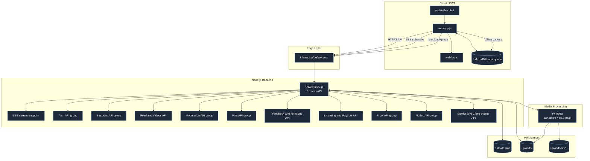

# Architecture Overview (Mermaid)

## Notes

- Realtime je jednostrani push preko SSE (server -> client).
- Upload pipeline je chunk-based, sa optional AES-GCM chunk enkripcijom.
- Offline-first tok koristi IndexedDB queue i kasniji re-upload.
- Trenutna perzistencija je file-based (`data/db.json` + `uploads/`), uz plan migracije na Postgres + object storage.
