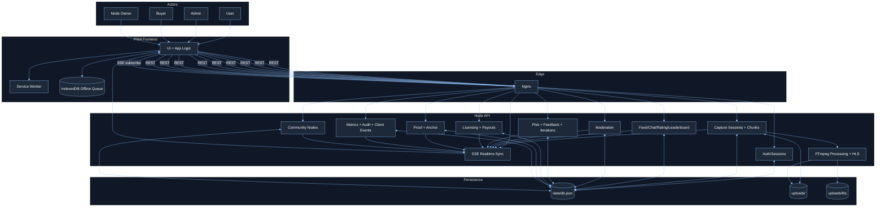

# 00 Master Overview

## Scope

Master pregled kombinuje:
- sistemski kontekst,
- aplikativne module,
- ingest/processing tok,
- realtime sync,
- governance i monetization tokove,
- data i deployment sloj.
