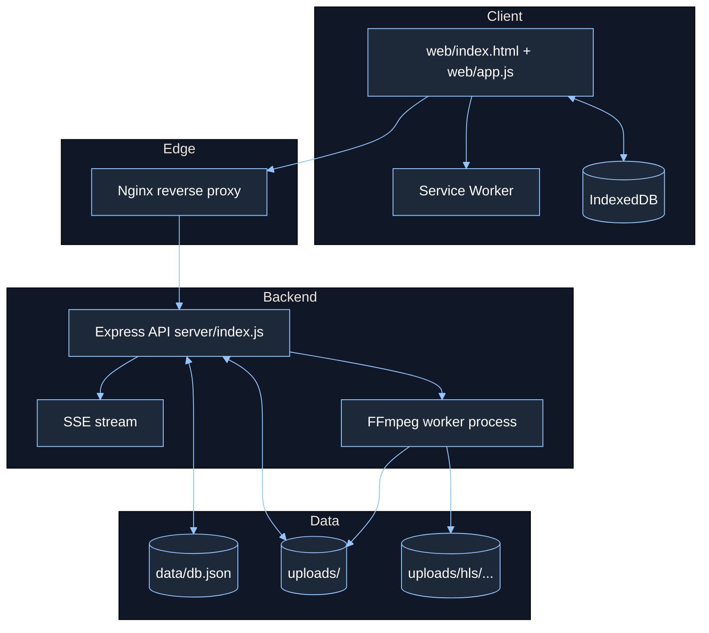

# 02 Container View

```mermaid
%%{init: {'theme':'base','themeVariables': {'primaryColor':'#1d2939','primaryTextColor':'#ffffff','primaryBorderColor':'#93c5fd','lineColor':'#93c5fd','secondaryColor':'#344054','tertiaryColor':'#101828','background':'#101828'}}}%%
flowchart TB
    subgraph Client
      PWA[web/index.html + web/app.js]
      SW[Service Worker]
      IDB[(IndexedDB)]
      PWA --> SW
      PWA <--> IDB
    end

    subgraph Edge
      NGINX[Nginx reverse proxy]
    end

    subgraph Backend
      API[Express API server/index.js]
      SSE[SSE stream]
      FF[FFmpeg worker process]
      API --> SSE
      API --> FF
    end

    subgraph Data
      DB[(data/db.json)]
      Uploads[(uploads/)]
      HLS[(uploads/hls/...)]
    end

    PWA --> NGINX --> API
    API <--> DB
    API <--> Uploads
    FF --> Uploads
    FF --> HLS

    classDef x fill:#1d2939,stroke:#93c5fd,color:#fff
    class PWA,SW,IDB,NGINX,API,SSE,FF,DB,Uploads,HLS x
```
