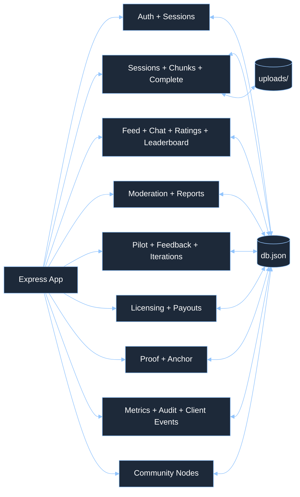

# 03 Backend Modules

```mermaid
%%{init: {'theme':'base','themeVariables': {'primaryColor':'#1d2939','primaryTextColor':'#ffffff','primaryBorderColor':'#93c5fd','lineColor':'#93c5fd','secondaryColor':'#344054','tertiaryColor':'#101828','background':'#101828'}}}%%
flowchart LR
    API[Express App]

    AUTH[Auth + Sessions]
    MEDIA[Sessions + Chunks + Complete]
    FEED[Feed + Chat + Ratings + Leaderboard]
    MOD[Moderation + Reports]
    PILOT[Pilot + Feedback + Iterations]
    LIC[Licensing + Payouts]
    PROOF[Proof + Anchor]
    OPS[Metrics + Audit + Client Events]
    NODE[Community Nodes]

    API --> AUTH
    API --> MEDIA
    API --> FEED
    API --> MOD
    API --> PILOT
    API --> LIC
    API --> PROOF
    API --> OPS
    API --> NODE

    DB[(db.json)]
    FS[(uploads/)]

    AUTH <--> DB
    MEDIA <--> DB
    MEDIA <--> FS
    FEED <--> DB
    MOD <--> DB
    PILOT <--> DB
    LIC <--> DB
    PROOF <--> DB
    OPS <--> DB
    NODE <--> DB

    classDef x fill:#1d2939,stroke:#93c5fd,color:#fff
    class API,AUTH,MEDIA,FEED,MOD,PILOT,LIC,PROOF,OPS,NODE,DB,FS x
```
