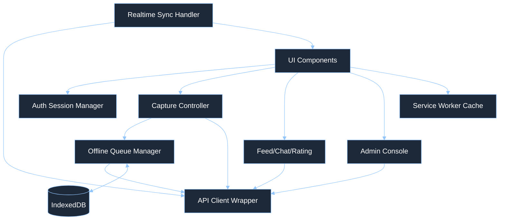

# 04 Frontend Modules

```mermaid
%%{init: {'theme':'base','themeVariables': {'primaryColor':'#1d2939','primaryTextColor':'#ffffff','primaryBorderColor':'#93c5fd','lineColor':'#93c5fd','secondaryColor':'#344054','tertiaryColor':'#101828','background':'#101828'}}}%%
flowchart TB
    UI[UI Components]
    AUTH[Auth Session Manager]
    CAP[Capture Controller]
    OFF[Offline Queue Manager]
    FEED[Feed/Chat/Rating]
    ADMIN[Admin Console]
    REAL[Realtime Sync Handler]
    API[API Client Wrapper]

    UI --> AUTH
    UI --> CAP
    UI --> FEED
    UI --> ADMIN

    CAP --> OFF
    CAP --> API
    OFF --> API
    FEED --> API
    ADMIN --> API
    REAL --> API
    REAL --> UI

    SW[Service Worker Cache]
    IDB[(IndexedDB)]
    OFF <--> IDB
    UI --> SW

    classDef x fill:#1d2939,stroke:#93c5fd,color:#fff
    class UI,AUTH,CAP,OFF,FEED,ADMIN,REAL,API,SW,IDB x
```
