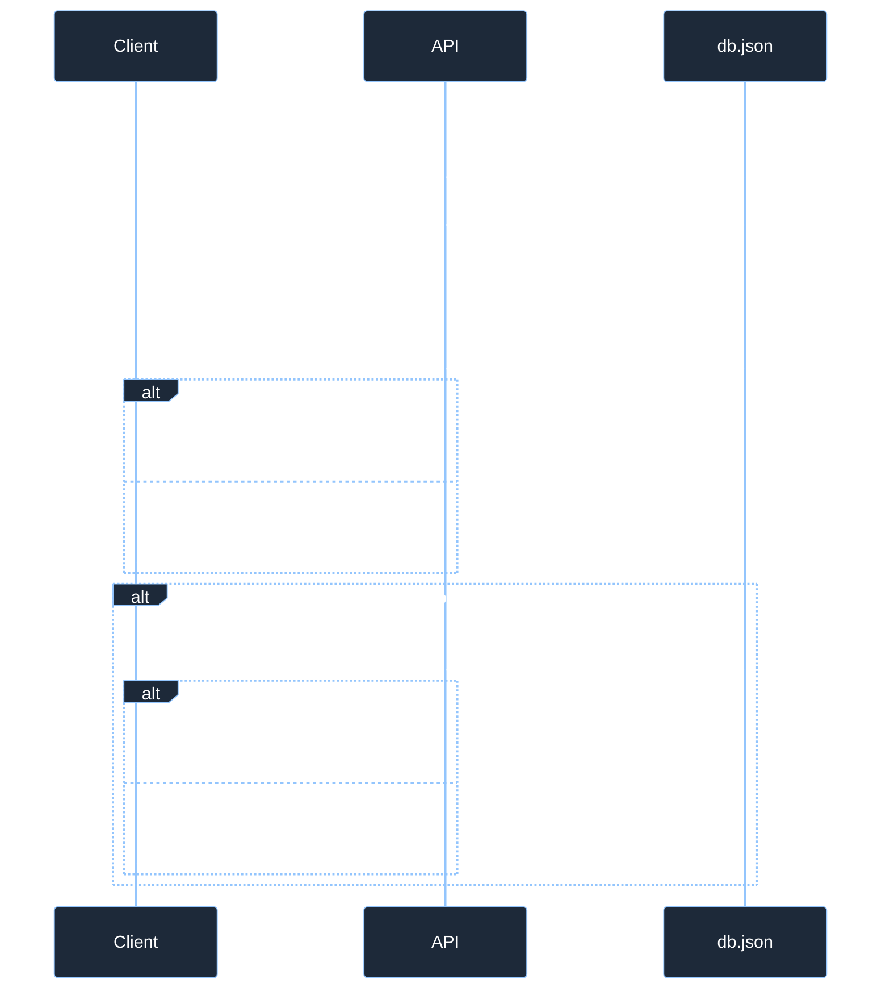

# 05 Auth and Security Flow

```mermaid
%%{init: {'theme':'base','themeVariables': {'primaryColor':'#1d2939','primaryTextColor':'#ffffff','primaryBorderColor':'#93c5fd','lineColor':'#93c5fd','secondaryColor':'#344054','tertiaryColor':'#101828','background':'#101828'}}}%%
sequenceDiagram
    participant C as Client
    participant A as API
    participant D as db.json

    C->>A: POST /api/auth/session
    A->>D: upsert user + role mapping
    A->>D: store token hash + TTL
    A-->>C: sessionToken + sessionExpiresAt

    C->>A: API write request (Bearer token)
    A->>D: resolve token hash + TTL check
    alt token valid
      A-->>C: 2xx
    else invalid/expired
      A-->>C: 401
    end

    alt admin-only endpoint
      A->>D: verify isAdmin
      alt admin
        A-->>C: allow
      else not admin
        A-->>C: 403
      end
    end
```
