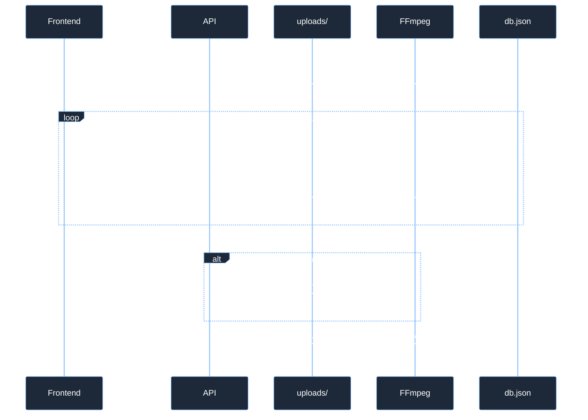

# 06 Upload and Processing Flow

```mermaid
%%{init: {'theme':'base','themeVariables': {'primaryColor':'#1d2939','primaryTextColor':'#ffffff','primaryBorderColor':'#93c5fd','lineColor':'#93c5fd','secondaryColor':'#344054','tertiaryColor':'#101828','background':'#101828'}}}%%
sequenceDiagram
    participant FE as Frontend
    participant API as API
    participant FS as uploads/
    participant FF as FFmpeg
    participant DB as db.json

    FE->>API: POST /api/sessions
    API->>DB: create recording session
    API-->>FE: sessionId + chunk crypto settings

    loop chunks
      FE->>API: POST /api/sessions/:id/chunks
      API->>FS: append chunk
      API->>DB: update bytes/duration
      API-->>FE: 202
    end

    FE->>API: POST /api/sessions/:id/complete
    alt processingMode=server
      API->>FF: transcode mp4 + HLS
      FF->>FS: write outputs
    end
    API->>DB: finalize session + proof + metrics
    API-->>FE: fileUrl/hls/proof
```
