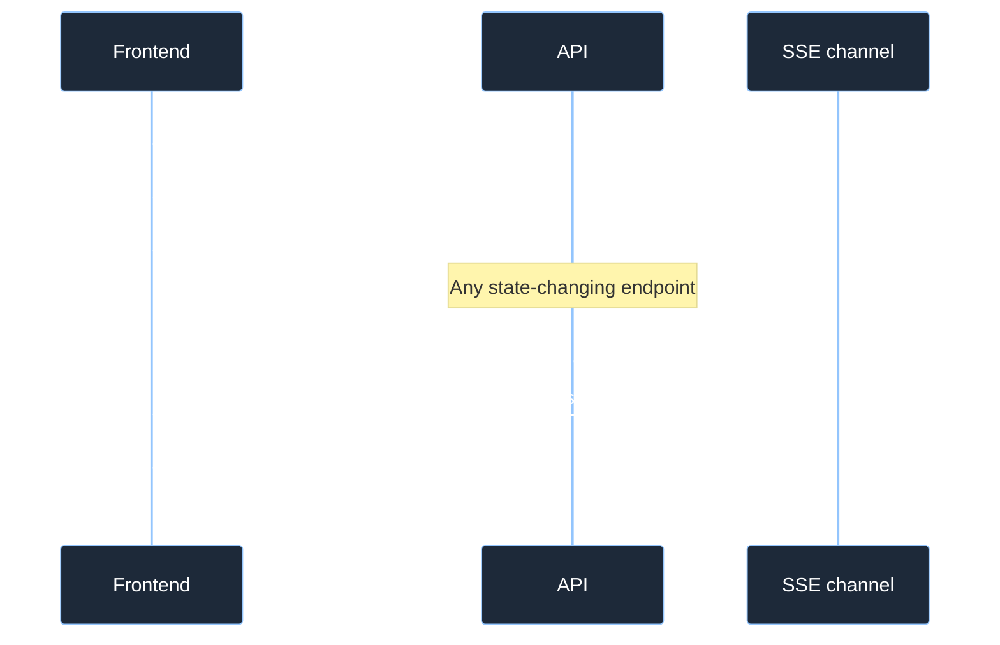

# 07 Realtime Sync Flow (SSE)

```mermaid
%%{init: {'theme':'base','themeVariables': {'primaryColor':'#1d2939','primaryTextColor':'#ffffff','primaryBorderColor':'#93c5fd','lineColor':'#93c5fd','secondaryColor':'#344054','tertiaryColor':'#101828','background':'#101828'}}}%%
sequenceDiagram
    participant FE as Frontend
    participant API as API
    participant SSE as SSE channel

    FE->>API: GET /api/realtime/stream?sessionToken=...
    API-->>FE: event: ready
    API-->>FE: event: sync(initial)

    Note over API: Any state-changing endpoint
    API->>SSE: broadcast sync payload
    SSE-->>FE: event: sync(feed/myVideos/limits/...)

    FE->>API: refresh relevant endpoints
    API-->>FE: fresh data
```
