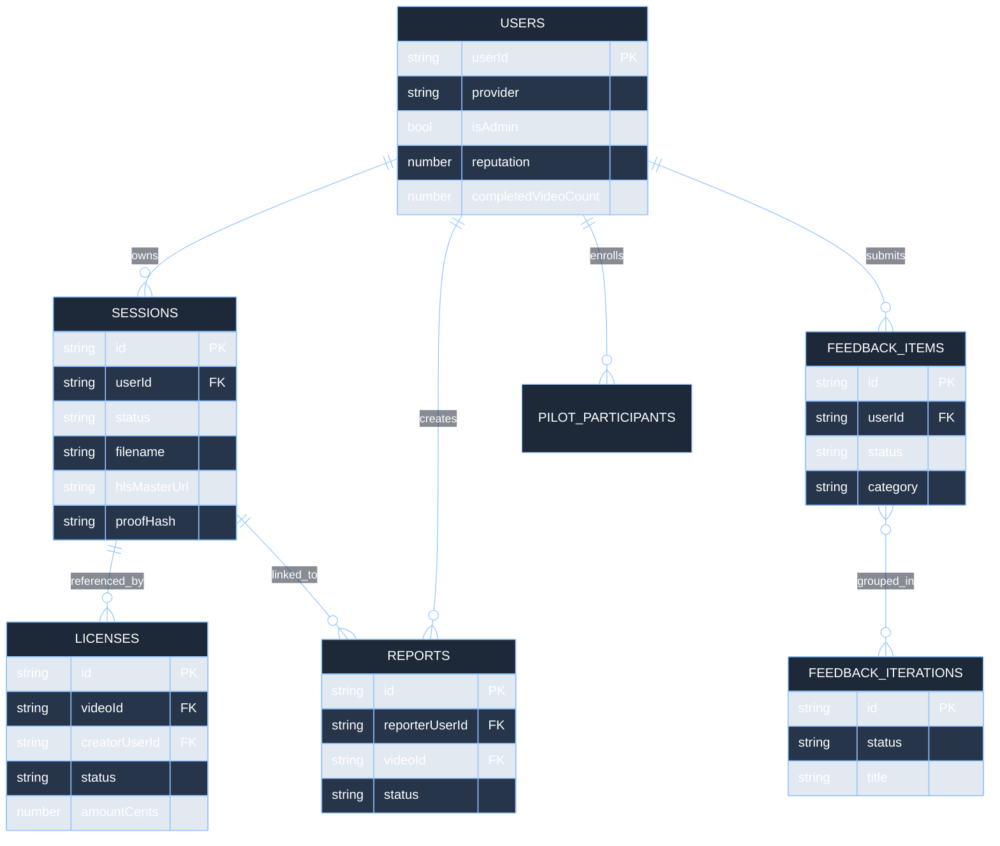

# 08 Data Model (ERD-style)

```mermaid
%%{init: {'theme':'base','themeVariables': {'primaryColor':'#1d2939','primaryTextColor':'#ffffff','primaryBorderColor':'#93c5fd','lineColor':'#93c5fd','secondaryColor':'#344054','tertiaryColor':'#101828','background':'#101828'}}}%%
erDiagram
    USERS ||--o{ SESSIONS : owns
    USERS ||--o{ REPORTS : creates
    USERS ||--o{ PILOT_PARTICIPANTS : enrolls
    USERS ||--o{ FEEDBACK_ITEMS : submits

    SESSIONS ||--o{ LICENSES : referenced_by
    SESSIONS ||--o{ REPORTS : linked_to

    FEEDBACK_ITEMS }o--o{ FEEDBACK_ITERATIONS : grouped_in

    USERS {
      string userId PK
      string provider
      bool isAdmin
      number reputation
      number completedVideoCount
    }

    SESSIONS {
      string id PK
      string userId FK
      string status
      string filename
      string hlsMasterUrl
      string proofHash
    }

    REPORTS {
      string id PK
      string reporterUserId FK
      string videoId FK
      string status
    }

    LICENSES {
      string id PK
      string videoId FK
      string creatorUserId FK
      string status
      number amountCents
    }

    FEEDBACK_ITEMS {
      string id PK
      string userId FK
      string status
      string category
    }

    FEEDBACK_ITERATIONS {
      string id PK
      string status
      string title
    }
```
