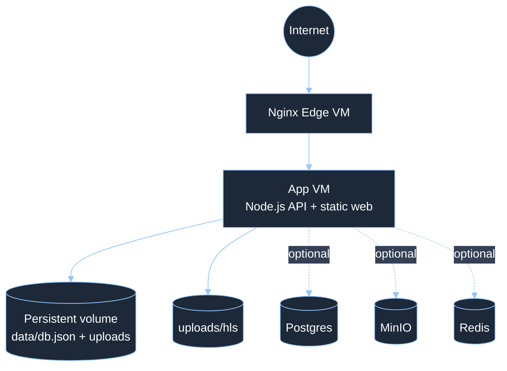

# 09 Deployment Topology (Proxmox-oriented)

```mermaid
%%{init: {'theme':'base','themeVariables': {'primaryColor':'#1d2939','primaryTextColor':'#ffffff','primaryBorderColor':'#93c5fd','lineColor':'#93c5fd','secondaryColor':'#344054','tertiaryColor':'#101828','background':'#101828'}}}%%
flowchart TB
    Internet((Internet)) --> Edge[Nginx Edge VM]
    Edge --> App[App VM\nNode.js API + static web]
    App --> Data[(Persistent volume\ndata/db.json + uploads)]
    App --> HLS[(uploads/hls)]

    App -.optional.-> PG[(Postgres)]
    App -.optional.-> MinIO[(MinIO)]
    App -.optional.-> Redis[(Redis)]

    classDef x fill:#1d2939,stroke:#93c5fd,color:#fff
    class Internet,Edge,App,Data,HLS,PG,MinIO,Redis x
```
