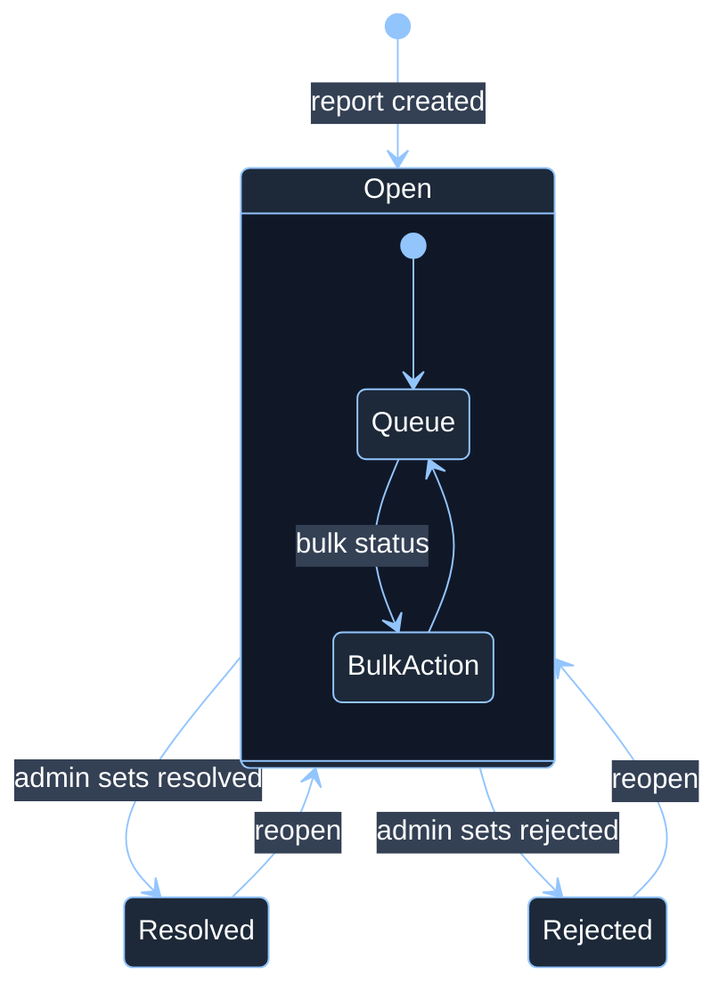

# 10 Moderation Workflow

```mermaid
%%{init: {'theme':'base','themeVariables': {'primaryColor':'#1d2939','primaryTextColor':'#ffffff','primaryBorderColor':'#93c5fd','lineColor':'#93c5fd','secondaryColor':'#344054','tertiaryColor':'#101828','background':'#101828'}}}%%
stateDiagram-v2
    [*] --> Open : report created
    Open --> Resolved : admin sets resolved
    Open --> Rejected : admin sets rejected
    Resolved --> Open : reopen
    Rejected --> Open : reopen

    state Open {
      [*] --> Queue
      Queue --> BulkAction : bulk status
      BulkAction --> Queue
    }
```
