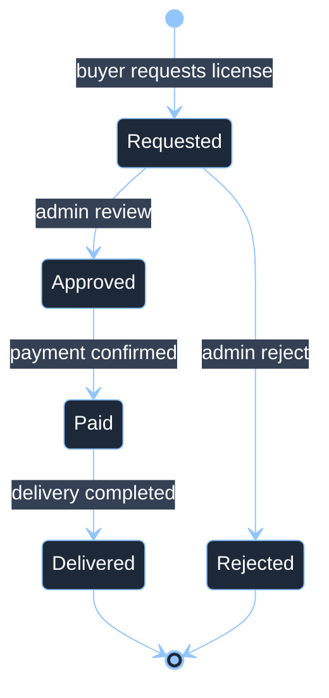

# 11 Licensing and Payout Workflow

```mermaid
%%{init: {'theme':'base','themeVariables': {'primaryColor':'#1d2939','primaryTextColor':'#ffffff','primaryBorderColor':'#93c5fd','lineColor':'#93c5fd','secondaryColor':'#344054','tertiaryColor':'#101828','background':'#101828'}}}%%
stateDiagram-v2
    [*] --> Requested : buyer requests license
    Requested --> Approved : admin review
    Requested --> Rejected : admin reject
    Approved --> Paid : payment confirmed
    Paid --> Delivered : delivery completed
    Delivered --> [*]
    Rejected --> [*]
```
