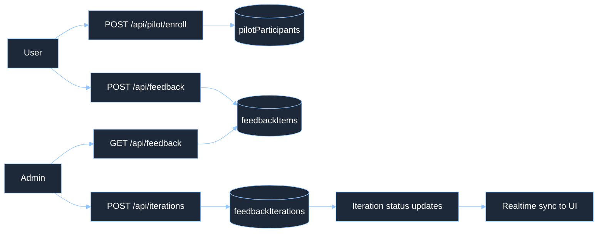

# 12 Pilot, Feedback, Iteration Workflow

```mermaid
%%{init: {'theme':'base','themeVariables': {'primaryColor':'#1d2939','primaryTextColor':'#ffffff','primaryBorderColor':'#93c5fd','lineColor':'#93c5fd','secondaryColor':'#344054','tertiaryColor':'#101828','background':'#101828'}}}%%
flowchart LR
    U[User] --> E[POST /api/pilot/enroll]
    E --> P[(pilotParticipants)]

    U --> F[POST /api/feedback]
    F --> FB[(feedbackItems)]

    A[Admin] --> Q[GET /api/feedback]
    Q --> FB
    A --> I[POST /api/iterations]
    I --> IT[(feedbackIterations)]

    IT --> S[Iteration status updates]
    S --> R[Realtime sync to UI]

    classDef x fill:#1d2939,stroke:#93c5fd,color:#fff
    class U,E,P,F,FB,A,Q,I,IT,S,R x
```
