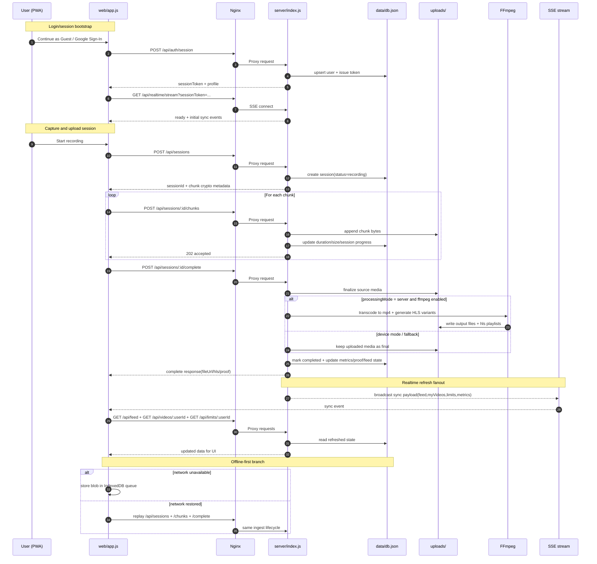

# Request Lifecycle (Mermaid)

## Notes

- API lifecycle je token-gated za write tokove (`Authorization: Bearer ...`).
- Chunk ingest je dizajniran za mobilnu mrežu (segmentisani upload + retry/offline queue).
- SSE ne prenosi kompletne podatke već signal za klijentski refresh relevantnih lista.
- Server-side processing i HLS su opcioni i zavise od FFmpeg dostupnosti/podešavanja.
